```python
import pandas as pd
import seaborn as sns
import matplotlib.pyplot as plt
```


```python
df = pd.read_csv("train.csv")
```

# Categorical Plots
## Factorplot
- seaborn.factorplot(x, y, hue, data, row, col..., aspect, size,...)
- x,y: Column 이름
- hue (option): Color encoding을 적용할 Column 이름
- data: Dataframe
- aspect(option): 실수, 가로/세로 비율


```python
sns.factorplot(x="Pclass", y="Survived", hue="Sex", data=df, aspect=0.9, size=3.5)
```

    c:\users\dmsgh\appdata\local\programs\python\python38\lib\site-packages\seaborn\categorical.py:3717: UserWarning: The `factorplot` function has been renamed to `catplot`. The original name will be removed in a future release. Please update your code. Note that the default `kind` in `factorplot` (`'point'`) has changed `'strip'` in `catplot`.
      warnings.warn(msg)
    c:\users\dmsgh\appdata\local\programs\python\python38\lib\site-packages\seaborn\categorical.py:3723: UserWarning: The `size` parameter has been renamed to `height`; please update your code.
      warnings.warn(msg, UserWarning)
    


    <seaborn.axisgrid.FacetGrid at 0x1b67460c550>


    
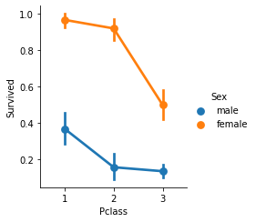
    


```python
sns.factorplot(x="Pclass", y="Survived", data=df, aspect=0.9, size=3.5)
```

    c:\users\dmsgh\appdata\local\programs\python\python38\lib\site-packages\seaborn\categorical.py:3717: UserWarning: The `factorplot` function has been renamed to `catplot`. The original name will be removed in a future release. Please update your code. Note that the default `kind` in `factorplot` (`'point'`) has changed `'strip'` in `catplot`.
      warnings.warn(msg)
    c:\users\dmsgh\appdata\local\programs\python\python38\lib\site-packages\seaborn\categorical.py:3723: UserWarning: The `size` parameter has been renamed to `height`; please update your code.
      warnings.warn(msg, UserWarning)
    


    <seaborn.axisgrid.FacetGrid at 0x1b6746c3850>


    
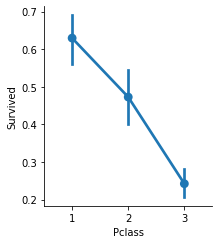
    


```python
sns.factorplot(x="Embarked", y="Survived", hue="Sex", data=df)
```

    c:\users\dmsgh\appdata\local\programs\python\python38\lib\site-packages\seaborn\categorical.py:3717: UserWarning: The `factorplot` function has been renamed to `catplot`. The original name will be removed in a future release. Please update your code. Note that the default `kind` in `factorplot` (`'point'`) has changed `'strip'` in `catplot`.
      warnings.warn(msg)
    


    <seaborn.axisgrid.FacetGrid at 0x1b6749583a0>


    
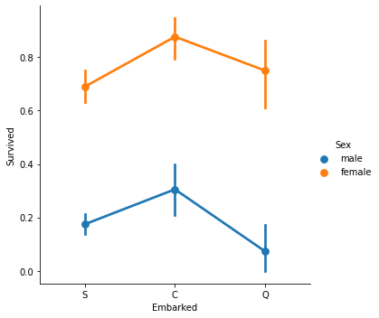
    


## Countplot
- 각 카테고리 값 별로 데이터가 얼마나 있는지 표시(변수의 발생 횟수)
- **seaborn.countplot(x="column_name", data=dataframe)**


```python
ax = sns.countplot(x="Sex", hue="Survived", palette="Set1", data=df)
ax.set(title="Survivors accoring to sex", xlabel="Sex",ylabel="Total")
plt.show()
```


    
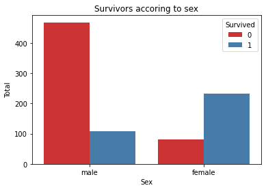
    


```python
sns.countplot(x="Pclass", data=df, palette = "Set2")
plt.title("Numbers of PClass")
plt.show()
```


    
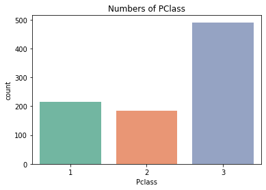
    


```python
sns.countplot(x="Pclass", hue = 'Survived',data=df)
plt.title("Numbers of PClass")
plt.show()
```


    
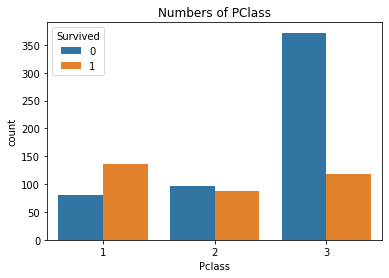
    


```python
df.head()
```


<div>
<style scoped>
    .dataframe tbody tr th:only-of-type {
        vertical-align: middle;
    }

    .dataframe tbody tr th {
        vertical-align: top;
    }

    .dataframe thead th {
        text-align: right;
    }
</style>
<table border="1" class="dataframe">
  <thead>
    <tr style="text-align: right;">
      <th></th>
      <th>PassengerId</th>
      <th>Survived</th>
      <th>Pclass</th>
      <th>Name</th>
      <th>Sex</th>
      <th>Age</th>
      <th>SibSp</th>
      <th>Parch</th>
      <th>Ticket</th>
      <th>Fare</th>
      <th>Cabin</th>
      <th>Embarked</th>
    </tr>
  </thead>
  <tbody>
    <tr>
      <th>0</th>
      <td>1</td>
      <td>0</td>
      <td>3</td>
      <td>Braund, Mr. Owen Harris</td>
      <td>male</td>
      <td>22.0</td>
      <td>1</td>
      <td>0</td>
      <td>A/5 21171</td>
      <td>7.2500</td>
      <td>NaN</td>
      <td>S</td>
    </tr>
    <tr>
      <th>1</th>
      <td>2</td>
      <td>1</td>
      <td>1</td>
      <td>Cumings, Mrs. John Bradley (Florence Briggs Th...</td>
      <td>female</td>
      <td>38.0</td>
      <td>1</td>
      <td>0</td>
      <td>PC 17599</td>
      <td>71.2833</td>
      <td>C85</td>
      <td>C</td>
    </tr>
    <tr>
      <th>2</th>
      <td>3</td>
      <td>1</td>
      <td>3</td>
      <td>Heikkinen, Miss. Laina</td>
      <td>female</td>
      <td>26.0</td>
      <td>0</td>
      <td>0</td>
      <td>STON/O2. 3101282</td>
      <td>7.9250</td>
      <td>NaN</td>
      <td>S</td>
    </tr>
    <tr>
      <th>3</th>
      <td>4</td>
      <td>1</td>
      <td>1</td>
      <td>Futrelle, Mrs. Jacques Heath (Lily May Peel)</td>
      <td>female</td>
      <td>35.0</td>
      <td>1</td>
      <td>0</td>
      <td>113803</td>
      <td>53.1000</td>
      <td>C123</td>
      <td>S</td>
    </tr>
    <tr>
      <th>4</th>
      <td>5</td>
      <td>0</td>
      <td>3</td>
      <td>Allen, Mr. William Henry</td>
      <td>male</td>
      <td>35.0</td>
      <td>0</td>
      <td>0</td>
      <td>373450</td>
      <td>8.0500</td>
      <td>NaN</td>
      <td>S</td>
    </tr>
  </tbody>
</table>
</div>


## FacetGrid
- FacetGrid에 데이터프레임과 row, col, hue 등 전달해 객체 생성
- 객체(facet)의 map 함수에 적용할 그래프의 종류와 Column 전달
- outelier 데이터 확인 가능


```python
graph = sns.FacetGrid(df, col="Survived")
graph.map(plt.hist, "Fare", bins=20) # 각 서브 플롯에 적용할 그래프 종류를 map() 이용하여 그리드 객체에 전달
```


    <seaborn.axisgrid.FacetGrid at 0x1b674abf9d0>


    
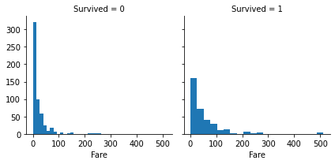
    


```python
graph = sns.FacetGrid(df, col="Sex")
graph.map(plt.hist, "Fare", bins=20, color ='r')
```


    <seaborn.axisgrid.FacetGrid at 0x1b674c20fa0>


    
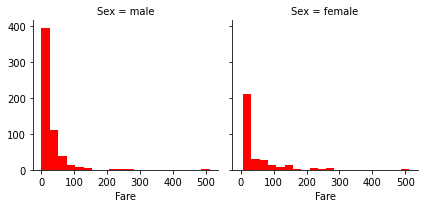
    


```python
graph = sns.FacetGrid(df, col="Sex", row = "Survived")
graph = graph.map(plt.hist, "Fare", bins=20, color ='y')
```


    
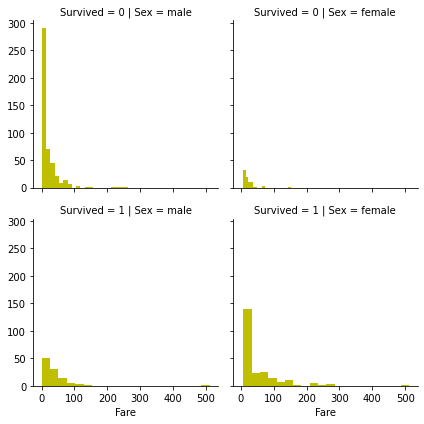
    


```python
graph = sns.FacetGrid(df, col="Sex", hue = "Survived", size = 4)
graph = graph.map(plt.hist, "Fare", bins=20)
```

    c:\users\dmsgh\appdata\local\programs\python\python38\lib\site-packages\seaborn\axisgrid.py:337: UserWarning: The `size` parameter has been renamed to `height`; please update your code.
      warnings.warn(msg, UserWarning)
    


    
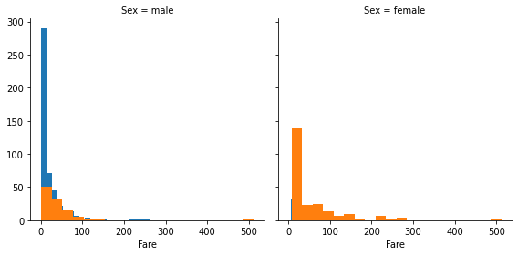
    


- 히스토그램 뿐만 아니라 아래와 같이 regplot을 이용하여 시각화 가능
- 색깔 별로 어떤 값을 나타내는지 legend 추가(범례 추가)


```python
graph = sns.FacetGrid(df, col="Sex", hue = "Survived", size = 4)
graph = graph.map(sns.regplot, "Fare", 'Age',fit_reg=False)
graph=graph.add_legend()
```

    c:\users\dmsgh\appdata\local\programs\python\python38\lib\site-packages\seaborn\axisgrid.py:337: UserWarning: The `size` parameter has been renamed to `height`; please update your code.
      warnings.warn(msg, UserWarning)
    


    
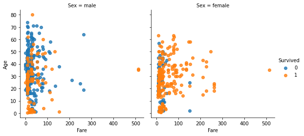
    


- X축, Y축 범위 추가


```python
graph = sns.FacetGrid(df, col="Sex", hue = "Survived", size = 4)
graph = graph.map(sns.regplot, "Fare", 'Age',fit_reg=False)
graph=graph.add_legend()
graph.set(xlim = (1,300), ylim=(0,100))
```

    c:\users\dmsgh\appdata\local\programs\python\python38\lib\site-packages\seaborn\axisgrid.py:337: UserWarning: The `size` parameter has been renamed to `height`; please update your code.
      warnings.warn(msg, UserWarning)
    


    <seaborn.axisgrid.FacetGrid at 0x1b6760c05e0>


    
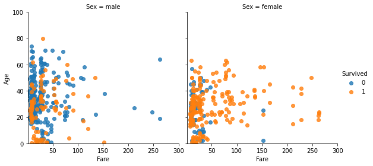
    

